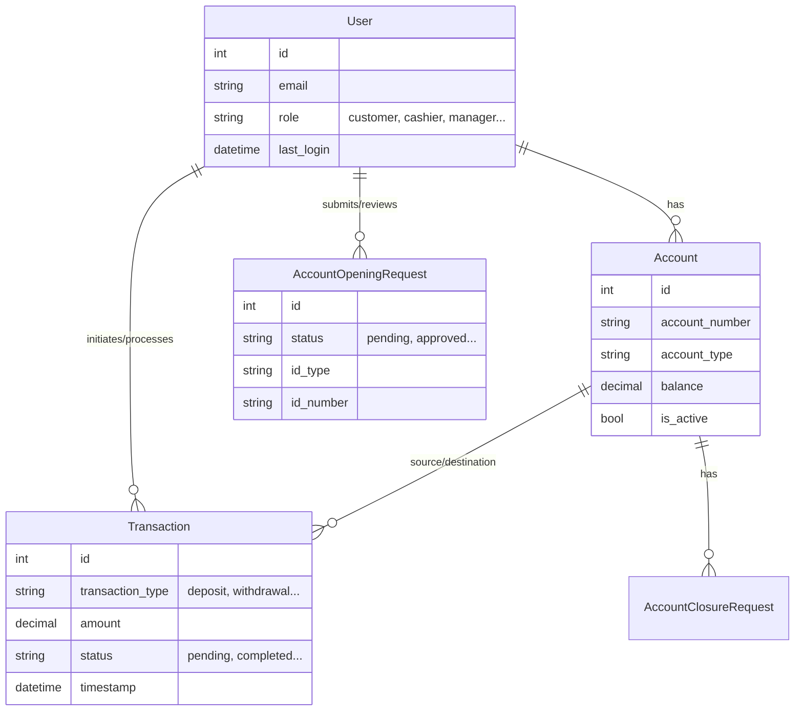
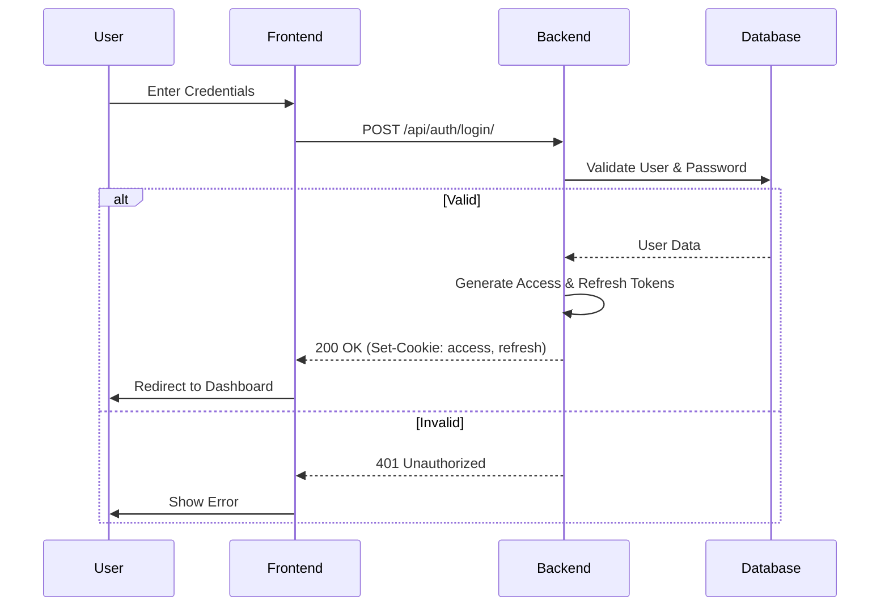
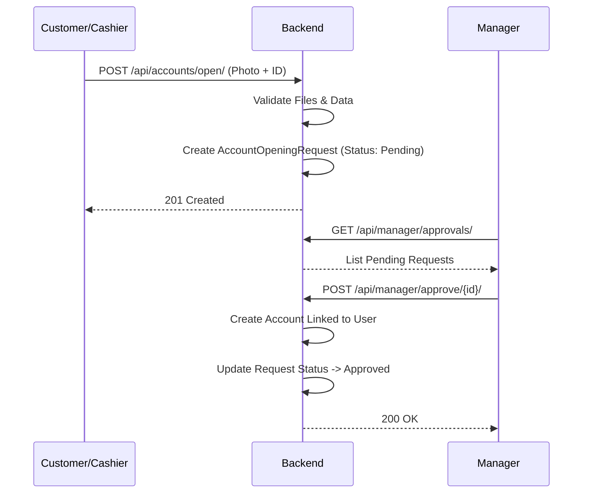

# Coastal Banking System - Complete Documentation


<!-- Source: 01-architecture.md -->

# System Architecture

## High-Level Overview
- **Frontend**: React 18, TypeScript, Vite, Tailwind CSS.
  - *Role*: SPA for Customer and Staff interactions.
  - *Proxy*: Vite Proxies API requests in dev to localhost:8000.
- **Backend**: Django 5.x, Django REST Framework (DRF).
  - *Role*: API provider, business logic, security enforcement.
  - *Server*: Gunicorn (WSGI) + Daphne (ASGI) for WebSockets.
- **Database**:
  - *Development*: SQLite.
  - *Production*: PostgreSQL 16 (on Render).
- **Authentication**: JWT (JSON Web Tokens) stored in HTTP-Only cookies.

## Deployment Topology (Render)

```mermaid
graph TD
    User[User Device] -->|HTTPS| LB[Load Balancer]
    LB -->|/api| Backend[Django Service (Gunicorn/Daphne)]
    LB -->|/*| Frontend[React Static Site]

    Backend -->|Read/Write| DB[(PostgreSQL)]
    Backend -->|Async/Cache| Redis[(Redis Stack)]
    Backend -->|SMS| Sendexa[Sendexa API]

    subgraph "Internal Network"
    Backend
    DB
    Redis
    end
```


---


<!-- Source: 02-data-models.md -->

# Data Architecture (ERD)

## Core Models
- **User**: Custom user model with role-based attributes (`customer`, `cashier`, `manager`, etc.).
- **Account**: Financial accounts (`daily_susu`, `savings`) linked to Users.
- **Transaction**: Records of funds movement (`deposit`, `withdrawal`, `transfer`).
- **AccountOpeningRequest**: Workflow model for new account approvals.

## Entity Relationship Diagram



---


<!-- Source: 03-logic-flows.md -->

# Logic Flows

## Authentication Flow
Secure login process using JWTs in HTTP-Only cookies to prevent XSS credential theft.



## Account Opening Workflow
Multi-step process requiring staff approval.




---


<!-- Source: 04-ui-ux.md -->

# UI/UX Design System

## Design Philosophy
"Modern, Trustworthy, and Efficient." The design uses a clean color palette and responsive layouts to ensure usability across devices.

## Color Palette (Tailwind)
- **Primary (Blue/Ocean)**: `#0066CC` (Brand), `#0c4a6e` (Deep Ocean).
- **Secondary (Slate)**: `#64748b` (Text), `#f8fafc` (Backgrounds).
- **Success (Submit)**: `#10b981` (Emerald).
- **Warning (Alerts)**: `#f59e0b` (Amber).
- **Error (Critical)**: `#ef4444` (Red).

## Typography
- **Headings**: *Google Sans Display* - Modern, geometric.
- **Body**: *Inter* - Highly readable UI font.
- **Monospaced**: *JetBrains Mono* - For code/IDs.

## Key Components
- **Glassmorphism**: Used in cards/modals for a premium feel (`backdrop-blur-md`).
- **Responsive Tables**: Mobile-friendly data grids for transaction history.
- **Interactive Forms**: Real-time validation and clear error states.


---


<!-- Source: 05-security.md -->

# Security Architecture

## Layers of Defense
1.  **Transport Layer**:
    - **HSTS**: Enforced strictly (`max-age=31536000`).
    - **HTTPS**: Required for all production traffic.
2.  **Application Layer (Backend)**:
    - **CSP**: Strict `Content-Security-Policy` preventing unsafe inline scripts.
    - **Throttling**: Rate limiting on sensitive endpoints (Login: 5/5min).
    - **Input Validation**: Strict serializers and file extension validators.
3.  **Authentication**:
    - **JWT**: Stateless auth with short-lived access tokens.
    - **Cookies**: `HttpOnly`, `Secure`, `SameSite=Lax/None`.
4.  **Database**:
    - **Partitioning**: Logic prepared for high-volume tables.
    - **Validation**: File upload validation at the model level to prevent RCE.

## Compliance
- **OWASP Top 10**: Mitigated (Injection, Broken Access Control, Logging).
- **Audit Logs**: Critical actions (Money movement, Role changes) are logged.


---


<!-- Source: 06-infrastructure.md -->

# Infrastructure & Configuration

## CORS & CSRF Strategy
The system uses a strict allowlist approach for Cross-Origin Resource Sharing and Cross-Site Request Forgery protection.

- **CORS Allowed Origins**:
  - Production: `https://coastal-web.onrender.com`, `https://coastal-project.onrender.com`
  - Development (Debug=True): `http://localhost:3000`, `http://127.0.0.1:3000`
- **CSRF Protection**:
  - `CSRF_TRUSTED_ORIGINS`: Matches CORS origins + dynamic Render subdomains (`https://*.onrender.com`).
  - **Cookies**: `SameSite=Lax` (Strict for Prod), `Secure=True` (HTTPS only), `HttpOnly=True`.

## Redis & Caching Architecture
Redis is the backbone for async operations and caching in production.

- **Broker URL**: Configured via `REDIS_URL` env variable.
- **Channel Layers (`daphne`)**:
  - Uses `channels_redis` for WebSocket message distribution (Chat, Real-time notifications).
  - Fallback: `InMemoryChannelLayer` for local dev if Redis is absent.
- **Celery Task Queue**:
  - **Enabled**: Only if `REDIS_URL` is present.
  - **Tasks**: Async email sending, PDF generation, Heavy reports.

## API Throttling (Rate Limiting)
To prevent abuse, `rest_framework.throttling` is configured globally:

| Scope | Rate | Purpose |
|-------|------|---------|
| `anon` | 100/hour | Prevent scraping by bots |
| `user` | 1000/hour | Standard user activity |
| `login` | **5/5min** | Anti-brute force protection |
| `otp_verify` | **3/5min** | Prevent OTP guessing |
| `token_refresh` | 10/min | Limit session extension attacks |

## External Services
- **SMS Gateway**: `Sendexa` (Configured via `SENDEXA_API_KEY`, `SENDEXA_SENDER_ID`).
- **Monitoring**:
  - **Sentry**: Error tracking (Enabled if `SENTRY_DSN` set).
  - **Prometheus**: Metrics middleware (`django_prometheus`) for Grafana/monitoring.


---


<!-- Source: 07-api-reference.md -->

# API Reference

A comprehensive guide to the Coastal Banking REST API Endpoints.
Base URL: `/api/`

## 1. Authentication & Users (`/api/users/`)

| Endpoint | Method | Description | Access |
|----------|--------|-------------|--------|
| `auth/login/` | POST | Authenticate user & set JWT cookies | Public |
| `auth/logout/` | POST | Blacklist token & clear cookies | Auth |
| `auth/refresh/` | POST | Refresh access token | Public |
| `auth/check/` | GET | Verify current session status | Public |
| `auth/register/` | POST | Register new customer | Public |
| `create/` | POST | Create staff account | Manager+ |
| `send-otp/` | POST | Trigger OTP via SMS/Email | Auth |
| `verify-otp/` | POST | Verify OTP code | Auth |
| `me/` | GET | Get current user profile | Auth |
| `members/` | GET | List all customer accounts | Staff |

## 2. Core Banking (`/api/`)

### Accounts
| Endpoint | Method | Description | Access |
|----------|--------|-------------|--------|
| `accounts/` | GET/POST | List/Create accounts | Staff |
| `banking/account-openings/` | GET/POST | Manage opening requests | Staff |
| `banking/account-closures/` | GET/POST | Manage closure requests | Manager |
| `banking/staff-accounts/` | GET | View internal staff logic | Manager |

### Transactions
| Endpoint | Method | Description | Access |
|----------|--------|-------------|--------|
| `transactions/` | GET/POST | Ledger of all transfers | Auth |
| `banking/refunds/` | POST | Process transaction refund | Manager |
| `banking/cash-advances/` | POST | Issue cash advance | Cashier |
| `check-deposits/` | POST | Upload & process checks | Cashier |

### Loans & Credit
| Endpoint | Method | Description | Access |
|----------|--------|-------------|--------|
| `loans/` | GET/POST | Loan application management | Auth |

## 3. Operations & Management

### Analytics
| Endpoint | Method | Description | Access |
|----------|--------|-------------|--------|
| `performance/system-health/` | GET | CPU/Memory/DB status | Admin |
| `performance/dashboard-data/` | GET | Aggregated KPI metrics | Manager |
| `audit/dashboard/` | GET | Security audit logs | Admin |
| `operations/mobile-banker-metrics/` | GET | Field agent performance | Manager |

### Calculators
| Endpoint | Method | Description | Access |
|----------|--------|-------------|--------|
| `operations/calculate-interest/` | POST | Forecast interest returns | Staff |
| `operations/calculate-commission/` | POST | Compute agent fees | Staff |

## 4. Communication

| Endpoint | Method | Description | Access |
|----------|--------|-------------|--------|
| `chat/rooms/` | GET/POST | Real-time chat threads | Auth |
| `banking/messages/` | GET/POST | Secure inbox messages | Auth |
| `messaging/preferences/` | GET/PUT | Notification settings | Auth |

## 5. Machine Learning (Fraud)

| Endpoint | Method | Description | Access |
|----------|--------|-------------|--------|
| `ml/fraud/analyze/` | POST | Real-time txn risk score | System |
| `ml/fraud/batch-analyze/` | POST | Bulk historical scan | Admin |


---
