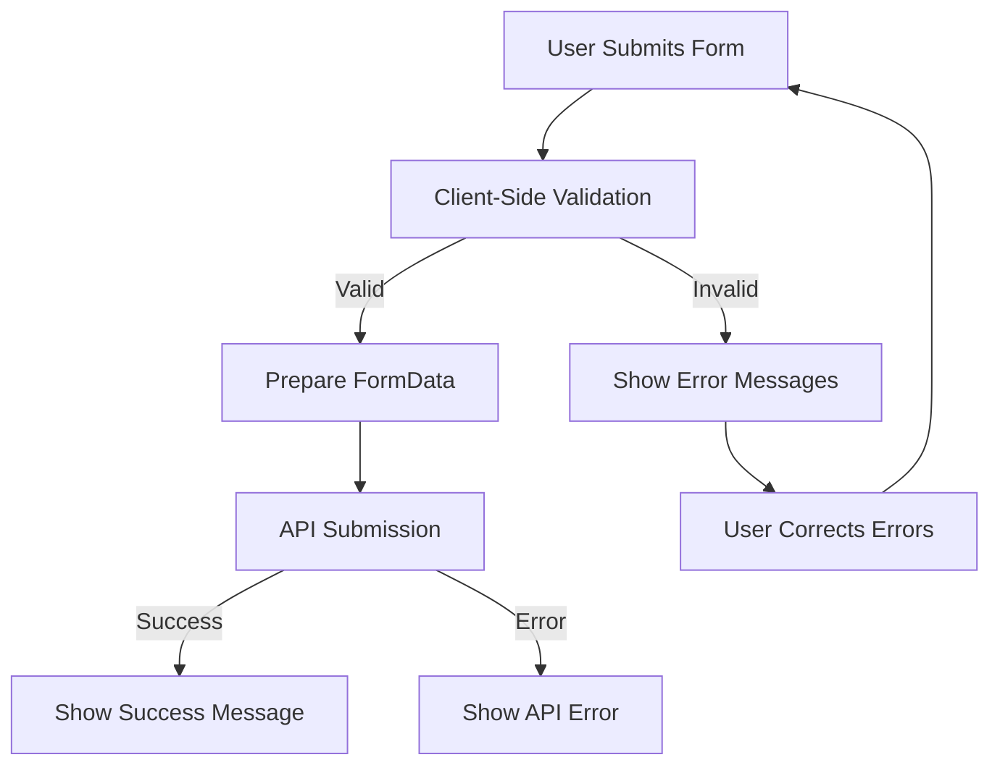
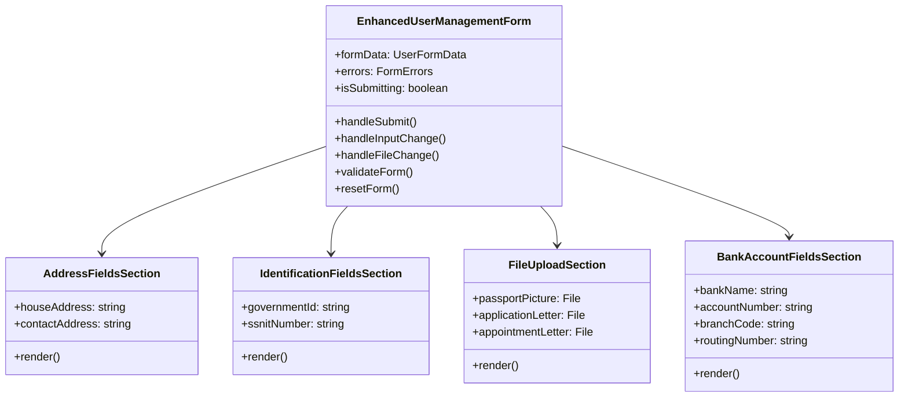
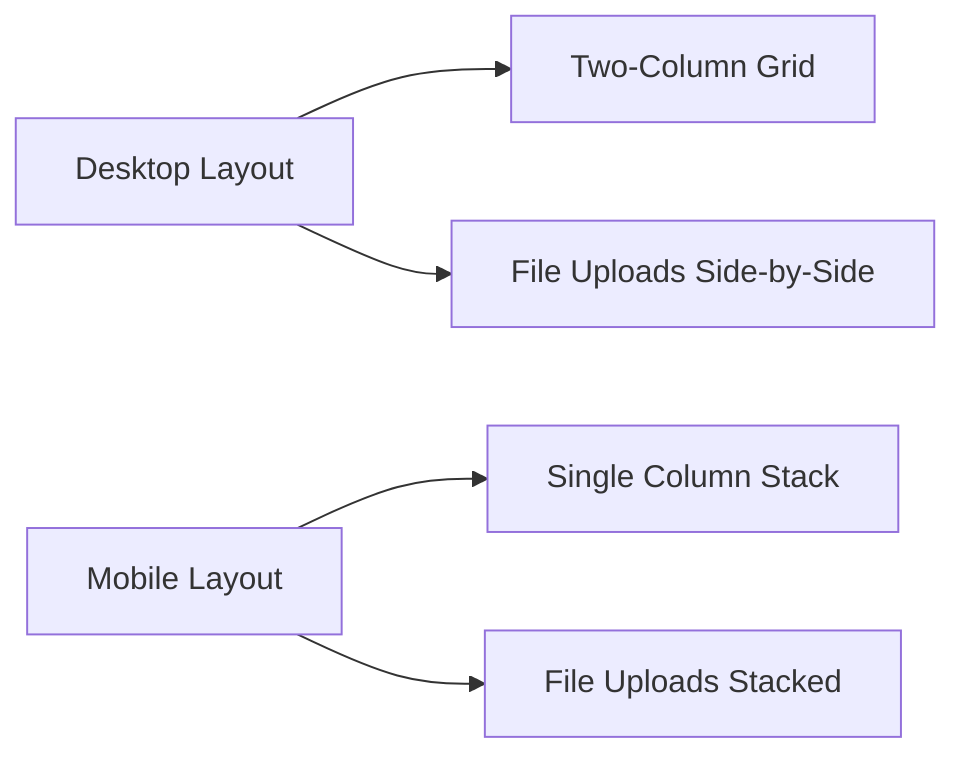
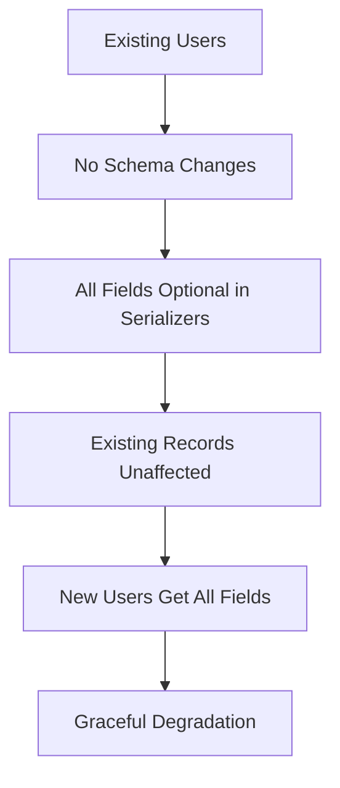

# User Management Form Structure - Visual Diagram

## Form Layout (Mermaid Diagram)

```mermaid
graph TD
    A[User Management Form] --> B[Personal Information Section]
    A --> C[Address Information Section]
    A --> D[Identification Information Section]
    A --> E[File Uploads Section]
    A --> F[Bank Account Details Section]
    A --> G[OTP Verification Section]
    A --> H[Submit Button]

    B --> B1[First Name]
    B --> B2[Last Name]
    B --> B3[Email]
    B --> B4[Phone Number]
    B --> B5[Role Selection]

    C --> C1[House Address]
    C --> C2[Contact Address]

    D --> D1[Government ID]
    D --> D2[SSNIT Number]

    E --> E1[Passport Picture Upload]
    E --> E2[Application Letter Upload]
    E --> E3[Appointment Letter Upload]

    F --> F1[Bank Name]
    F --> F2[Account Number]
    F --> F3[Branch Code]
    F --> F4[Routing Number]

    G --> G1[OTP Input]
    G --> G2[Verify Button]
```

## Field Requirements Matrix

| Field Name | Type | Required | Validation Rules | Error Message |
|------------|------|----------|------------------|----------------|
| First Name | Text | Yes | Min 2 chars | "First name must be at least 2 characters" |
| Last Name | Text | Yes | Min 2 chars | "Last name must be at least 2 characters" |
| Email | Email | Yes | Valid email format | "Please enter a valid email address" |
| Phone | Text | Yes | Valid phone format | "Please enter a valid phone number" |
| Role | Select | Yes | Valid role selection | "Please select a valid role" |
| House Address | Textarea | Yes | Min 10 chars | "House address must be at least 10 characters" |
| Contact Address | Textarea | Yes | Min 10 chars | "Contact address must be at least 10 characters" |
| Government ID | Text | Yes | 6-20 alphanumeric | "Government ID must be 6-20 letters/numbers" |
| SSNIT Number | Text | Yes | 12 digits | "SSNIT must be 12 digits (AAA-NN-NNNNN)" |
| Passport Picture | File | Yes | JPEG/PNG, ≤2MB | "Only JPEG/PNG files ≤2MB allowed" |
| Application Letter | File | Yes | PDF, ≤5MB | "Only PDF files ≤5MB allowed" |
| Appointment Letter | File | Yes | PDF, ≤5MB | "Only PDF files ≤5MB allowed" |
| Bank Name | Text | Yes | Min 3 chars | "Bank name must be at least 3 characters" |
| Account Number | Text | Yes | 8-20 alphanumeric | "Account number must be 8-20 letters/numbers" |
| Branch Code | Text | Yes | 3-10 alphanumeric | "Branch code must be 3-10 letters/numbers" |
| Routing Number | Text | Yes | 9 digits | "Routing number must be 9 digits" |

## File Upload Specifications

### Passport Picture
- **Accepted Formats**: JPEG, JPG, PNG
- **Maximum Size**: 2 MB (2,097,152 bytes)
- **Dimensions**: No specific requirements
- **Preview**: Show thumbnail after upload
- **Validation**: Check file type and size before upload

### Application Letter
- **Accepted Formats**: PDF only
- **Maximum Size**: 5 MB (5,242,880 bytes)
- **Pages**: No page limit
- **Preview**: Show file name and size
- **Validation**: Check file type and size before upload

### Appointment Letter
- **Accepted Formats**: PDF only
- **Maximum Size**: 5 MB (5,242,880 bytes)
- **Pages**: No page limit
- **Preview**: Show file name and size
- **Validation**: Check file type and size before upload

## Form Validation Flow

## Error Display Strategy

1. **Inline Errors**: Show errors below each field
2. **Summary Errors**: Show summary at top of form
3. **File Errors**: Show specific file validation errors
4. **API Errors**: Show server-side validation errors

## UI Component Structure

## Responsive Layout Design

## Integration Points

1. **Manager Dashboard**: Replace `UserManagementSection` with new form
2. **Operations Manager Dashboard**: Replace `UserManagementSection` with new form
3. **API Service**: Update `createUser` to handle file uploads
4. **CSS**: Add styles for new form components

## Backward Compatibility

This diagram provides a comprehensive visual representation of the new user management form structure, validation requirements, and integration strategy.