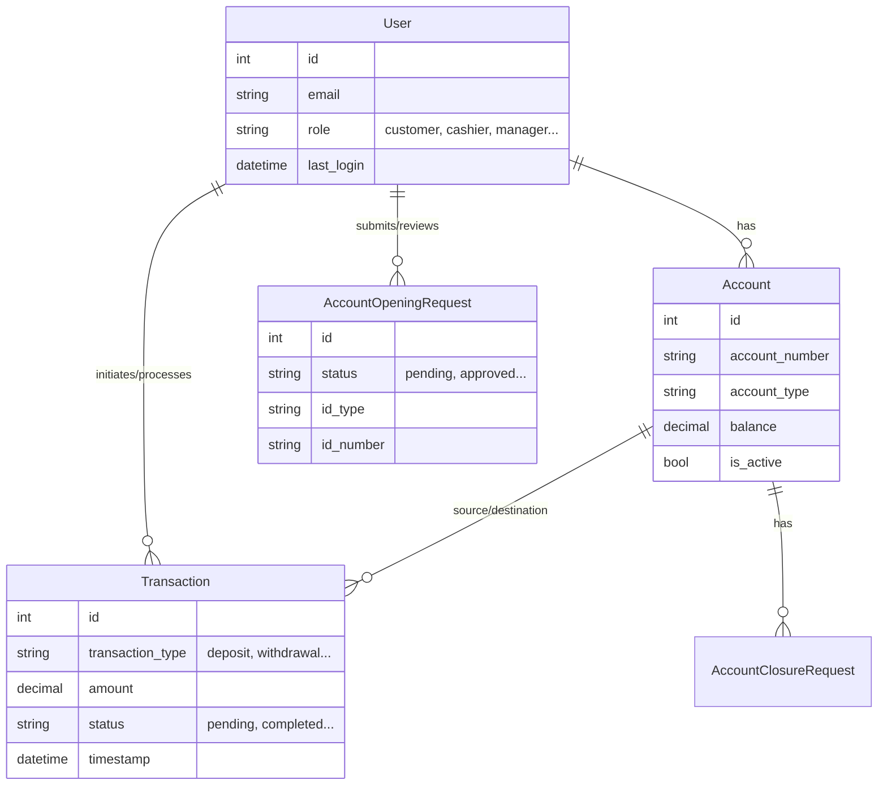

# Data Architecture (ERD)

## Core Models
- **User**: Custom user model with role-based attributes (`customer`, `cashier`, `manager`, etc.).
- **Account**: Financial accounts (`daily_susu`, `savings`) linked to Users.
- **Transaction**: Records of funds movement (`deposit`, `withdrawal`, `transfer`).
- **AccountOpeningRequest**: Workflow model for new account approvals.

## Entity Relationship Diagram

