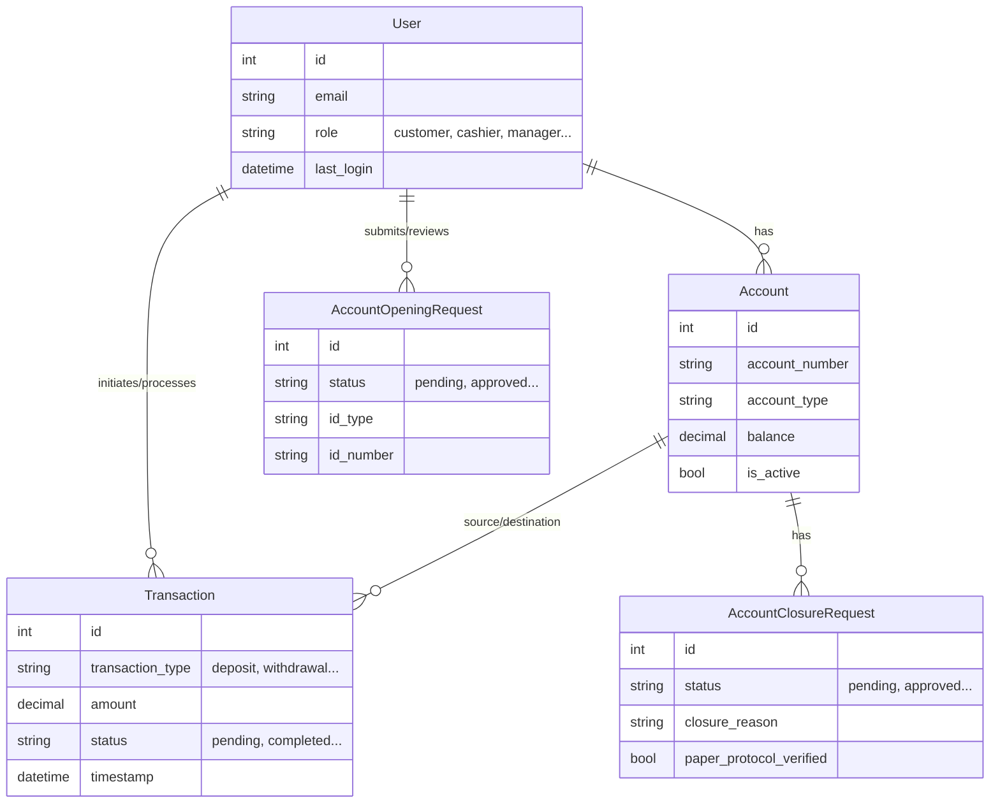

# Data Architecture (ERD)

## Core Models
- **User**: Custom user model with role-based attributes (`customer`, `cashier`, `manager`, etc.).
- **Account**: Financial accounts (`daily_susu`, `savings`) linked to Users.
- **Transaction**: Records of funds movement (`deposit`, `withdrawal`, `transfer`).
- **AccountOpeningRequest**: Workflow model for new account approvals (Maker-Checker enforced).
- **AccountClosureRequest**: Workflow model for account termination (Paper Protocol enforced).
- **IdempotencyKey**: Security model to prevent double-spending and duplicate requests.

## Entity Relationship Diagram

```mermaid
erDiagram
    User ||--o{ Account : "has"
    User ||--o{ AccountOpeningRequest : "submits/reviews"
    User ||--o{ Transaction : "initiates/processes"
    Account ||--o{ Transaction : "source/destination"
    Account ||--o{ AccountClosureRequest : "has"

    User {
        int id
        string email
        string role "customer, cashier, manager..."
        datetime last_login
    }

    Account {
        int id
        string account_number
        string account_type
        decimal balance
        bool is_active
    }

    Transaction {
        int id
        string transaction_type "deposit, withdrawal..."
        decimal amount
        string status "pending, completed..."
        datetime timestamp
    }

    AccountOpeningRequest {
        int id
        string status "pending, approved..."
        string id_type
        string id_number
    }

    AccountClosureRequest {
        int id
        string status "pending, approved..."
        string closure_reason
        bool paper_protocol_verified
    }
```

## 🔒 Architectural Constraints

1.  **Maker-Checker (4-Eyes Principle)**: Enforced via model-level `clean()` validation. The user who submits a request (`submitted_by`) cannot be the same user who approves it (`approved_by`).
2.  **Zero-Plaintext PII**: All Personal Identifiable Information (Names, IDs, Phone Numbers) is stored using **Fernet Authenticated Encryption** (`AES-128-CBC + HMAC-SHA256`).
3.  **Unified Naming (db_table)**: Core models strictly enforce `Meta.db_table` names (e.g., `user`, `account`, `transaction`, `audit_log`) to prevent environment-specific schema drift and legacy Django naming conflicts.
4.  **Encryption Key Versioning**: Models storing PII include a `key_version` column to facilitate zero-downtime key rotation managed by `smart_migrate.py`.
5.  **Balance Integrity**: Accounts implement a `calculated_balance` property that re-sums the ledger. This must match the cached `balance` before any closure or high-value withdrawal.
6.  **Idempotency Protection**: All financial mutation endpoints (`POST`, `PUT`, `PATCH`) check for a unique `X-Idempotency-Key` (UUID).
    - **Mechanism**: If a key exists within the 24h TTL, the system returns the cached response instead of re-executing.
    - **Coverage**: Enforced on `TransactionViewSet` via `IdempotencyMixin` to prevent double-spend attacks.

** coastal.banking // data-v2.2 // binary-hardened // maker-checker-ready **
