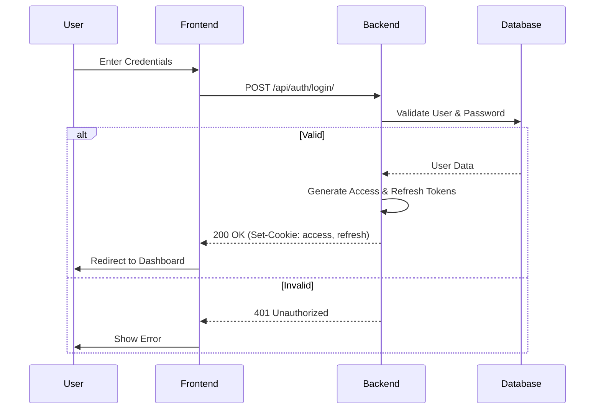
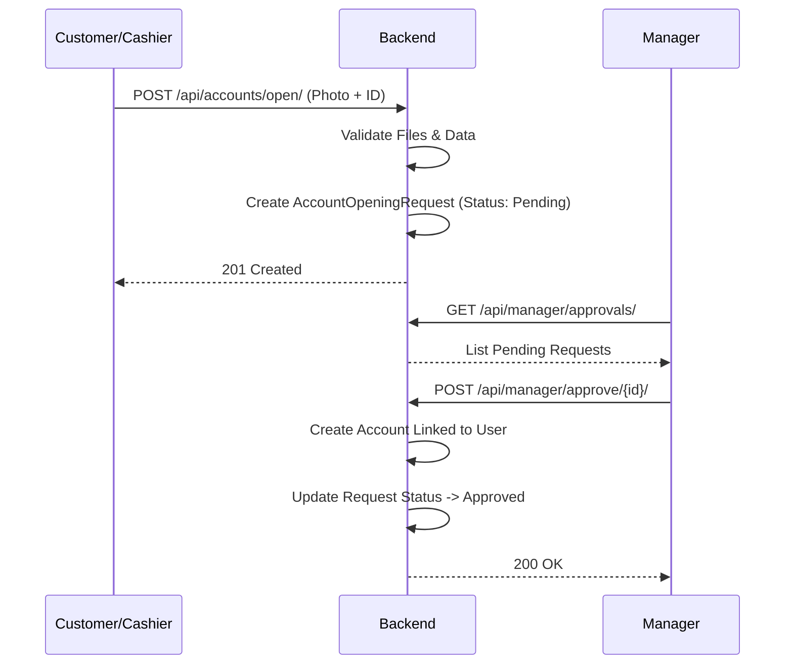

# Logic Flows

## Authentication Flow
Secure login process using JWTs in HTTP-Only cookies to prevent XSS credential theft.

## Account Opening Workflow
Multi-step process requiring staff approval.

