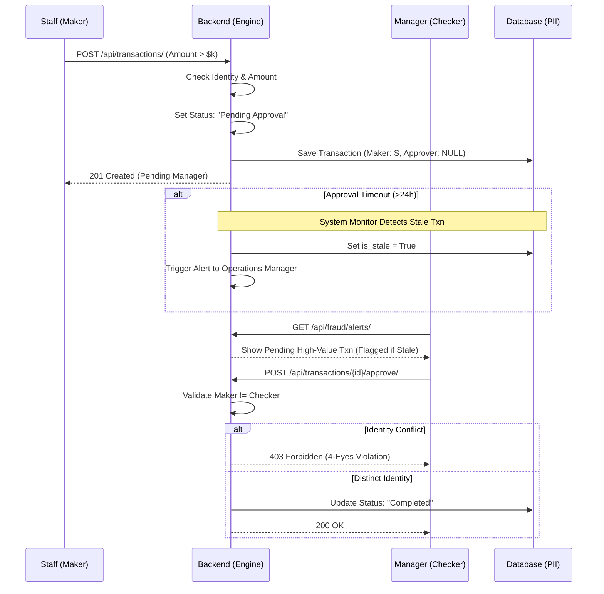
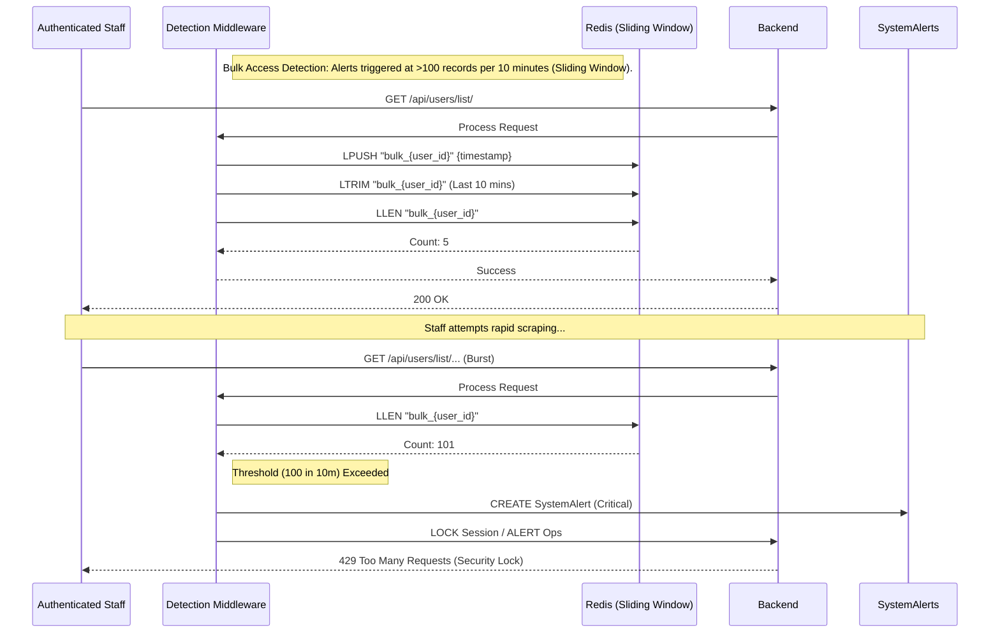
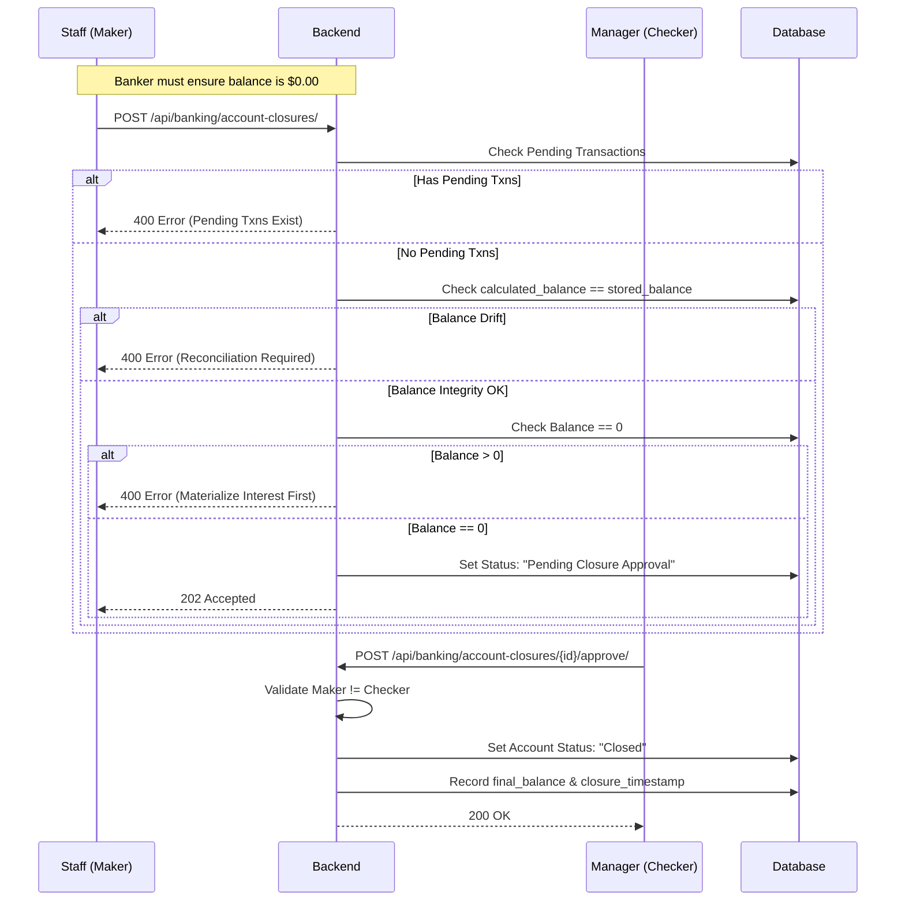
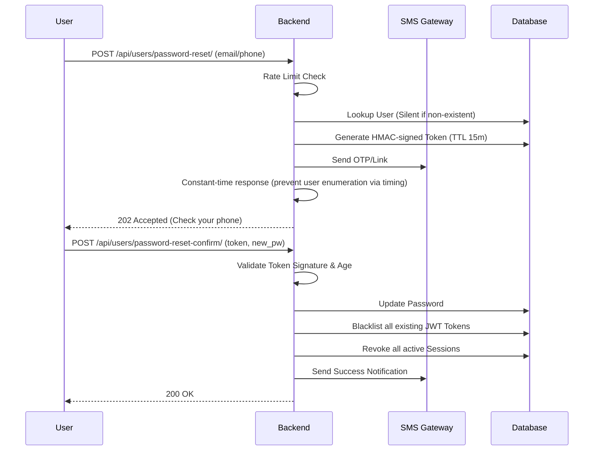
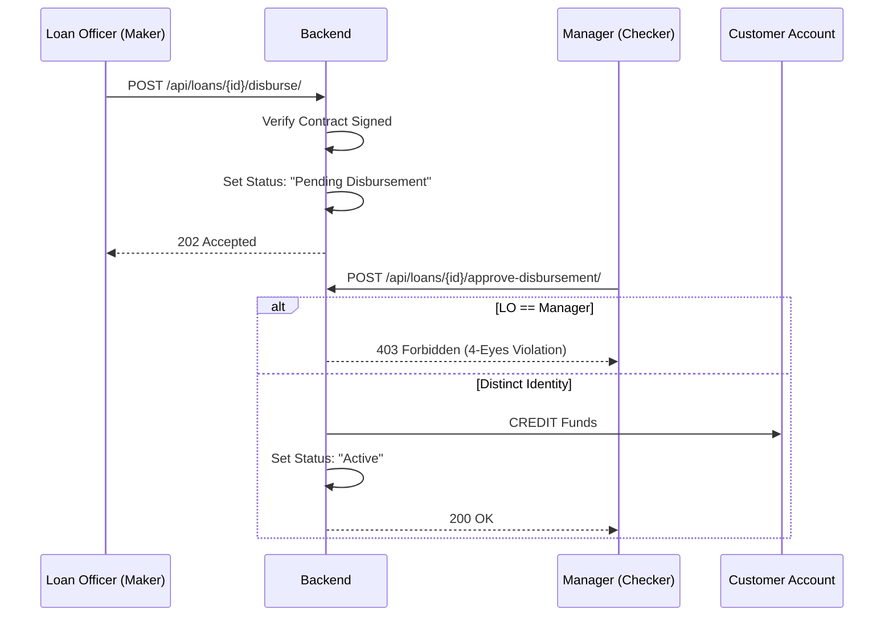
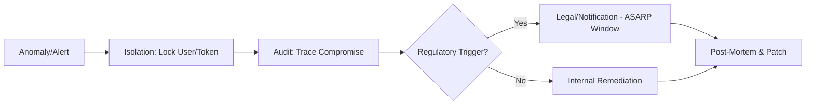

    U->>F: Redirect to Dashboard
    else Invalid
        B-->>F: 401 Unauthorized
        F->>U: Show Error
    end
```

---

## 🔒 1. Maker-Checker "4-Eyes" Principle
Ensures that no single staff member can authorize high-value transactions.


```mermaid
sequenceDiagram
    participant S as Staff (Maker)
    participant B as Backend (Engine)
    participant M as Manager (Checker)
    participant DB as Database (PII)

    S->>B: POST /api/transactions/ (Amount > $k)
    B->>B: Check Identity & Amount
    B->>B: Set Status: "Pending Approval"
    B->>DB: Save Transaction (Maker: S, Approver: NULL)
    B-->>S: 201 Created (Pending Manager)

    alt Approval Timeout (>24h)
        Note over B, DB: System Monitor Detects Stale Txn
        B->>DB: Set is_stale = True
        B->>B: Trigger Alert to Operations Manager
    end

    M->>B: GET /api/fraud/alerts/
    B-->>M: Show Pending High-Value Txn (Flagged if Stale)
    M->>B: POST /api/transactions/{id}/approve/
    B->>B: Validate Maker != Checker
    alt Identity Conflict
        B-->>M: 403 Forbidden (4-Eyes Violation)
    else Distinct Identity
        B->>DB: Update Status: "Completed"
        B-->>M: 200 OK
    end
```

---

## 🚨 2. Anomaly Detection (Dead Man's Switch)
Active behavioral monitoring to prevent bulk data exfiltration using a **10-minute sliding window**.


```mermaid
sequenceDiagram
    participant U as Authenticated Staff
    participant M as Detection Middleware
    participant C as Redis (Sliding Window)
    participant B as Backend
    participant A as SystemAlerts

    Note right of M: Bulk Access Detection: Alerts triggered at >100 records per 10 minutes (Sliding Window).

    U->>B: GET /api/users/list/
    B->>M: Process Request
    M->>C: LPUSH "bulk_{user_id}" {timestamp}
    M->>C: LTRIM "bulk_{user_id}" (Last 10 mins)
    M->>C: LLEN "bulk_{user_id}"
    C-->>M: Count: 5
    M-->>B: Success
    B-->>U: 200 OK

    Note over U, A: Staff attempts rapid scraping...
    U->>B: GET /api/users/list/... (Burst)
    B->>M: Process Request
    M->>C: LLEN "bulk_{user_id}"
    C-->>M: Count: 101
    Note right of M: Threshold (100 in 10m) Exceeded
    M->>A: CREATE SystemAlert (Critical)
    M->>B: LOCK Session / ALERT Ops
    B-->>U: 429 Too Many Requests (Security Lock)
```

---

## 🚪 3. Account Closure Approval
Workflow for retiring client accounts with zero-balance validation and interest materialization.


```mermaid
sequenceDiagram
    participant S as Staff (Maker)
    participant B as Backend
    participant M as Manager (Checker)
    participant DB as Database

    Note over S, B: Banker must ensure balance is $0.00
    S->>B: POST /api/banking/account-closures/
    B->>DB: Check Pending Transactions
    alt Has Pending Txns
        B-->>S: 400 Error (Pending Txns Exist)
    else No Pending Txns
        B->>DB: Check calculated_balance == stored_balance
        alt Balance Drift
            B-->>S: 400 Error (Reconciliation Required)
        else Balance Integrity OK
            B->>DB: Check Balance == 0
            alt Balance > 0
                B-->>S: 400 Error (Materialize Interest First)
            else Balance == 0
                B->>DB: Set Status: "Pending Closure Approval"
                B-->>S: 202 Accepted
            end
        end
    end

    M->>B: POST /api/banking/account-closures/{id}/approve/
    B->>B: Validate Maker != Checker
    B->>DB: Set Account Status: "Closed"
    B->>DB: Record final_balance & closure_timestamp
    B-->>M: 200 OK
```

---

## 🔑 4. Secure Password Reset (NIST 800-63B)
Self-service recovery flow with token-based verification and session invalidation.


```mermaid
sequenceDiagram
    participant U as User
    participant B as Backend
    participant SMS as SMS Gateway
    participant DB as Database

    U->>B: POST /api/users/password-reset/ (email/phone)
    B->>B: Rate Limit Check
    B->>DB: Lookup User (Silent if non-existent)
    B->>DB: Generate HMAC-signed Token (TTL 15m)
    B->>SMS: Send OTP/Link
    B->>B: Constant-time response (prevent user enumeration via timing)
    B-->>U: 202 Accepted (Check your phone)

    U->>B: POST /api/users/password-reset-confirm/ (token, new_pw)
    B->>B: Validate Token Signature & Age
    B->>DB: Update Password
    B->>DB: Blacklist all existing JWT Tokens
    B->>DB: Revoke all active Sessions
    B->>SMS: Send Success Notification
    B-->>U: 200 OK
```

---

## 💰 5. Loan Disbursement (Maker-Checker)
High-risk fund movement flow.


```mermaid
sequenceDiagram
    participant LO as Loan Officer (Maker)
    participant B as Backend
    participant M as Manager (Checker)
    participant C as Customer Account

    LO->>B: POST /api/loans/{id}/disburse/
    B->>B: Verify Contract Signed
    B->>B: Set Status: "Pending Disbursement"
    B-->>LO: 202 Accepted

    M->>B: POST /api/loans/{id}/approve-disbursement/
    alt LO == Manager
        B-->>M: 403 Forbidden (4-Eyes Violation)
    else Distinct Identity
        B->>C: CREDIT Funds
        B->>B: Set Status: "Active"
        B-->>M: 200 OK
    end
```

---

## 🔑 6. Key Rotation Procedure
Automated and manual secret rotation logic with `key_version` tracking.

```mermaid
graph TD
    A[Admin Trigger] --> B{Rotation Script}
    B -->|1. Generate| C[New Master Secret (V+1)]
    C -->|2. Batch Update| D[Iterate Records where key_version < V+1]
    D -->|3. Re-encrypt| E[PII re-encrypted with New Key]
    E -->|4. Update Meta| F[Set key_version = V+1]
    F -->|5. Verify| G{Integrity Check}
    G -->|Success| H[Set NEW_KEY as CURRENT_KEY]
    G -->|Failure| J[Rollback: Keep OLD_KEY as CURRENT]
    H -->|6. Archive| I[Retire OLD_KEY]
```

---

## 🚑 7. Incident Response (IR) Flow
The "Detect -> Isolate -> Notify -> Remediate" protocol.


```mermaid
graph LR
    A[Anomaly/Alert] --> B[Isolation: Lock User/Token]
    B --> C[Audit: Trace Compromise]
    C --> D{Regulatory Trigger?}
    D -->|Yes| E[Legal/Notification - ASARP Window]
    D -->|No| F[Internal Remediation]
    E --> G[Post-Mortem & Patch]
    F --> G
```

---

** coastal.banking // logic-v1 // zero-trust-architecture // fail-closed **
