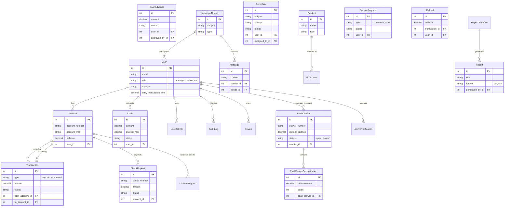
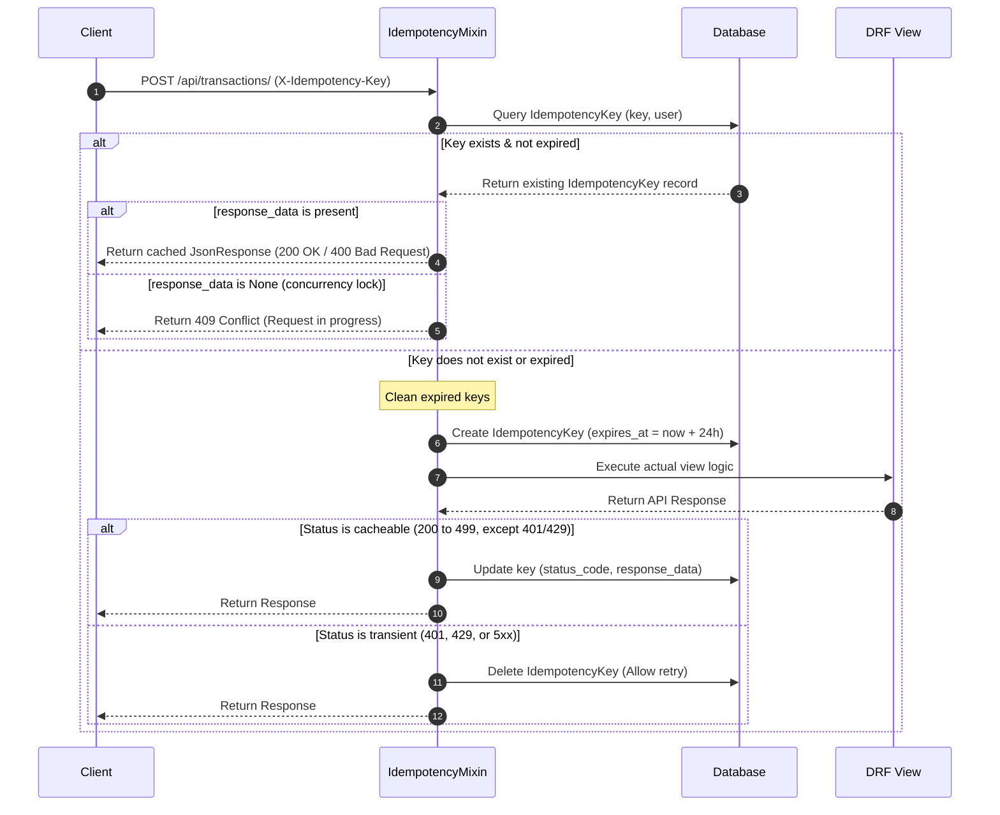

# Full Project Documentation

This document compiles the core technical specifications of the Coastal Banking System, including System Architecture, Data Architecture (Data Models & ERD), and Infrastructure & Security Configurations.

---

## 1. System Architecture

### High-Level Overview
- **Frontend**: React 18, TypeScript, Vite, Tailwind CSS.
  - *Role*: SPA for Customer and Staff interactions.
  - *Server*: Node 22 (Web Service) using `server.js` for secure API/WS proxying.
- **Backend**: Django 6.0 & Django REST Framework (DRF).
  - *Role*: API provider, business logic, security enforcement.
  - *Server*: Gunicorn (WSGI) + Daphne (ASGI) with Uvicorn workers.
- **Database**:
  - *Development*: SQLite.
  - *Production*: PostgreSQL 18 (Managed on Render).
- **Authentication**: JWT (JSON Web Tokens) cross-platform via HttpOnly, Secure cookies.

### Deployment Topology (Render)

```mermaid
graph TD
    User[User Device] -->|HTTPS / mTLS| LB[Load Balancer]
    LB -->|/api| Backend[Django Service (Python Container)]
    LB -->|/*| Frontend[Node Web Service - Vite SPA]
    
    Backend -->|Read/Write| DB[(PostgreSQL 18)]
    Backend -->|Async/Cache| Redis[(Redis Stack)]
    Backend -->|Outbound SMS| Sendexa[Sendexa API]
    Backend -->|Error Tracking| Sentry[Sentry]
    Backend -->|Metrics| Prometheus[Prometheus]
    Backend -->|Tasks| Celery[Celery Worker]
    Celery -->|Read/Write| DB
    Celery -->|Queue| Redis

    Secrets[/etc/secrets/] -->|Injected at startup| Backend

    subgraph "Internal Network"
        Backend
        DB
        Redis
        Celery
    end
```

---

## 2. Data Models & ERD

### Core Models
- **User**: Custom user model with role-based attributes (`customer`, `cashier`, `manager`, etc.).
- **Account**: Financial accounts (`daily_susu`, `savings`) linked to Users.
- **Transaction**: Records of funds movement (`deposit`, `withdrawal`, `transfer`).
- **AccountOpeningRequest**: Workflow model for new account approvals (Maker-Checker enforced).
- **AccountClosureRequest**: Workflow model for account termination (Paper Protocol enforced).
- **IdempotencyKey**: Security model to prevent double-spending and duplicate requests.

### Entity Relationship Diagram


### 🔒 Architectural Constraints

1. **Maker-Checker (4-Eyes Principle)**: Enforced via model-level `clean()` validation. The user who submits a request (`submitted_by`) cannot be the same user who approves it (`approved_by`).
2. **Zero-Plaintext PII**: All Personal Identifiable Information (Names, IDs, Phone Numbers) is stored using **Fernet Authenticated Encryption** (`AES-128-CBC + HMAC-SHA256`).
3. **Unified Naming (db_table)**: Core models strictly enforce `Meta.db_table` names (e.g., `user`, `account`, `transaction`, `audit_log`) to prevent environment-specific schema drift and legacy Django naming conflicts.
4. **Encryption Key Versioning**: Models storing PII include a `key_version` column to facilitate zero-downtime key rotation managed by `smart_migrate.py`.
5. **Balance Integrity**: Accounts implement a `calculated_balance` property that re-sums the ledger. This must match the cached `balance` before any closure or high-value withdrawal.
6. **Idempotency Protection**: All financial mutation endpoints (`POST`, `PUT`, `PATCH`) check for a unique `X-Idempotency-Key` (UUID).
   - **Mechanism**: If a key exists within the 24h TTL, the system returns the cached response instead of re-executing.
   - **Coverage**: Enforced on `TransactionViewSet` via `IdempotencyMixin` to prevent double-spend attacks.

---

## 3. Infrastructure & Config

### 1. Hosting & Geo-Residency
- **Provider**: **Render (Cloud)**.
- **Primary Region**: **Frankfurt, Germany (eu-central-1)**. [Confirmed]
- **Databases**: **PostgreSQL 18** (Primary), **Redis 7** (Caching/WS).
- **Compliance Status**: GDPR-compliant. 
- **Roadmap**: Transitioning to **local Ghanaian data residency** (Bank of Ghana Act 612) via Accra-based Tier-3 data centers (Phase 2: **Q4 2026**).

### 2. Encryption & Secrets (`SecretManager`)
The system employs a **Resource Injection** pattern for secrets to decouple sensitive keys from the process environment.
- **At-Rest**: **AES-128-CBC + HMAC-SHA256** (Fernet Authenticated Encryption).
  - *Auditor Note*: HMAC-SHA256 provides authentication/integrity checking before decryption, effectively mitigating CBC-mode specific vulnerabilities (e.g., padding oracles).
- **Searchable Hash**: **HMAC-SHA256 (Blind Indexing)**.
- **Secrets Management**: Managed via `core/utils/secret_service.py` which prioritizes **Secret Files** injected at `/etc/secrets/` (Render-Native Secret Groups).
- **Security Control**: Prevents secret leakage via `/proc/self/environ` or management logs.
- **HSM Path**: Abstraction ready for **AWS KMS / Google Cloud KMS** (Migration planned for Phase 2: **Q3 2026**).

### 3. Network & Transport Security
- **Protocol**: **TLS 1.2 / 1.3 (AES-256)** enforced for all API traffic.
- **mTLS [Foundation]**: `MTLSVerificationMiddleware` implemented to require **Client Certificates** for staff and internal operational endpoints.
  - **Guarded Paths**: `/api/banking/`, `/api/operations/`, `/api/reports/`, `/api/users/staff/`, `/api/users/management/`.
- **CORS / CSRF**: Strict allowlist for `onrender.com` subdomains and `localhost` (Dev).
- **HSTS / CSP**: Hardened security headers enforced to mitigate MitM and XSS.

### 4. Operational Integrity (4-Eyes Principle)
- **Maker-Checker Enforcement**: 
  - **Threshold**: $5,000.00 (Configurable via `TRANSACTION_APPROVAL_THRESHOLD`).
  - **Control**: Model-level validation ensures `processed_by != approved_by`.
- **Anomaly Detection (Bulk Access Prevention)**: 
  - **Burst Limit**: **100 records per 10 minutes** (Sliding Window).
  - **Action**: Immediate system-wide `SystemAlert` and logging of suspicious bulk data access.

### 5. API Throttling (Rate Limiting)
Standard `rest_framework.throttling` configurations:

| Scope | Rate | Purpose |
|-------|------|---------|
| `anon` | 100/hour | Bot protection |
| `user` | 1,000/hour | Standard activity |
| `login` | **5/5min** | Brute-force protection |
| `otp_verify` | **3/5min** | OTP guessing mitigation |

### 6. External Service Registry
- **Messaging**: `Sendexa` (Basic Auth via `SENDEXA_SERVER_KEY`, mounted from `/etc/secrets/`).
- **Redis & Daphne**: Backbone for real-time WebSockets (Chat/Alerts).
- **Celery**: Distributed task queue for asynchronous background processing (e.g., `daily_reports`, `fraud_analysis`, and `stale_transaction_detection` on a 24h cycle).
- **Monitoring**: 
  - **Sentry**: Error & performance tracking.
  - **Prometheus**: Metrics collection (`django_prometheus`).
  - **Audit Strategy**: **Immutable logs** (Write-Once enforcement) for `AuditLog` and `UserActivity`.

### 7. Continuity & Recovery (BCP/DRP)
- **Deployment Gate**: **`smart_migrate.py` (v8)**.
  - *Purpose*: Automatically detects and resolves schema drift between environments.
  - *Fail-safe*: Checks for custom `db_table` naming consistency and cleans redundant default Django tables (e.g., `users_user`) to prevent production `IntegrityErrors`.
- **Backup Policy**: 24-hour automated WAL-based backups for PostgreSQL.
- **RPO (Recovery Point Objective)**: < 5 minutes (via active WAL streaming).
- **RTO (Recovery Time Objective)**: < 4 hours (Service restoration from bucket storage).

### 8. Cloud Provider Security
- **Encryption at Rest**: AWS/Render standard managed encryption using EBS/RDS-integrated keys (FIPS 140-2 compliant).
- **Infrastructure as Code**: Terraform-managed configurations for reproducible environments.

### 9. Supply-Chain Security
- **Dependency Audit**: `pip-audit` version 2.10.0 integration for regular vulnerability scanning.
- **Vulnerability Remediation**: All critical patches (e.g., `aiohttp`) are applied within 24 hours of detection.
- **Automation**: GitHub Dependabot enabled for automated security PR generation.

### 10. Audit Logging
- **Immutable Log Entry**: All `AuditLog` records are protected by model-level `save` overrides that prevent modification/deletion.
- **Coverage**: 100% visibility on User Access, PII Decryption, and Loan Approvals.

---

## 4. Real-time Communication & WebSockets

### 1. Connection Lifecycle & Authentication
Real-time messaging is powered by **Django Channels** and served via **Daphne (ASGI)**.
- **Protocol**: Connections run over secure WebSockets (`wss://`).
- **Authentication**: WebSocket authentication is enforced using a custom `TokenAuthMiddleware` (defined in `config/channels_middleware.py`) which processes incoming connection handshakes:
  1. **HTTP Cookie (Primary)**: Attempts to extract the JWT `access` token directly from the request's HttpOnly cookie.
  2. **WS Protocol Header (Secondary)**: Looks for the token within the `sec-websocket-protocol` header.
  3. **Query Parameters (Fallback)**: Extracts the token from `?token=<JWT_TOKEN>` query strings.
- **Validation**: The token is mapped using Django SimpleJWT's `UntypedToken`. If the token is valid, the matching `User` model is appended to the connection scope; otherwise, an `AnonymousUser` is assigned.
- **Access Guard**: In `ChatConsumer.connect()`, if the connection scope contains an `AnonymousUser`, the socket connection is immediately aborted with close code `4001` (Unauthorized).

### 2. Channels Routing & Grouping
- **Endpoints**: WebSocket paths are defined via ASGI routing:
  - `ws/messaging/<room_id>/` maps directly to `ChatConsumer`.
- **Authorization (Membership Verification)**: Upon establishing a connection, `ChatConsumer` validates that the authenticated user is registered as an active member of the requested chat room. If not, the socket is terminated with close code `4003` (Forbidden).
- **Redis Grouping**: Authorized connections join a Redis-backed channel group named `chat_{room_id}`. Real-time messages broadcasted to this channel layer are immediately pushed to all active consumer instances in the group.
- **Data Exchange**: Message payloads are transmitted as JSON. The consumer intercepts incoming texts, validates payload integrity, saves messages to the PostgreSQL database asynchronously via `database_sync_to_async` helper tasks, and broadcasts the structured message object to the group.

---

## 5. Asynchronous Task Execution (Celery & Redis)

### 1. Distributed Task Architecture
To ensure high responsiveness on API endpoints, long-running calculations, data compilations, and third-party integrations are executed asynchronously outside the WSGI/ASGI thread pool.
- **Worker Framework**: **Celery** (powered by a Redis broker).
- **Environment**: Concurrency is managed via dedicated Celery workers run in isolated container groups.

### 2. Scheduled & Asynchronous Workloads
Key workloads registered in `core/tasks.py` include:
- `generate_daily_reports`: Periodically executes at the end of the business day to compile branch ledger summaries, transaction volumes, and operating expenses.
- `analyze_fraud_patterns` & `analyze_transaction_for_fraud`: Automated anomaly detection tasks that evaluate transaction parameters against ML-based baseline behaviors to automatically flag fraud alerts.
- `retrain_fraud_detection_model`: Periodic retraining of isolation forests and classifier models to incorporate newly labeled transactions.
- `send_email_notification`: Offloads SMTP transmission to prevent blocking of user-facing views during sign-up, login OTP dispatches, and alerts.
- `export_transaction_data`: Aggregates ledger history and generates CSV/PDF statement downloads asynchronously to protect the server from memory spikes.
- `system_health_check`: Heartbeat task executing system diagnostic checks against the database, caching layer, and network APIs to trigger warning alerts if performance metrics drop.

### 3. Reliability & Failure Mitigation
- **State Management**: Celery tasks track intermediate states (`PENDING`, `STARTED`, `SUCCESS`, `FAILURE`) using Redis as a results backend.
- **Exponential Backoff**: Tasks interacting with external integrations (e.g., Sendexa SMTP, geolocators) implement retry strategies:
  ```python
  @shared_task(bind=True, max_retries=3, default_retry_delay=60)
  ```
  If a third-party service is unreachable, the task is rescheduled with incremental delays to prevent request starvation on internal queues, raising a `MaxRetriesExceededError` only when all retries are exhausted.

---

## 6. API Idempotency Key Flow

### 1. Verification Protocol
To protect the system against network retry-induced double-spending (especially during mobile field collections or unstable network states), all mutation-heavy HTTP requests (`POST`, `PUT`, `PATCH`) must include a unique client-generated UUID in the `X-Idempotency-Key` header.
- **Implementation**: Managed via a generic `IdempotencyMixin` in `core/mixins.py` that wraps the standard DRF dispatch pipeline.

### 2. Lifecycle and Database Caching
Mermaid sequence diagram representing the idempotency lifecycle:



### 3. Architectural Rules & Fail-safes
- **TTL Enforced**: Idempotency keys are garbage collected using an `expires_at` timestamp set to exactly **24 hours** after creation.
- **Stripe-Aligned Error Resilience**: The system does not cache transient errors. If an API request fails with a server error (`5xx`), an authentication mismatch (`401`), or a rate-limit block (`429`), the mixin automatically deletes the generated `IdempotencyKey` record. This guarantees that clients can safely retry the identical operation with the same header key once the transient issue is resolved.

---

## 7. Cache Invalidation & Consistency Strategy

### 1. Critical Financial Data (No Caching)
To prevent double-spending, balance mismatches, and race conditions, the system enforces a **Zero-Cache policy on all mutable financial metrics**.
- **Real-Time Calculation**: Account balances, ledger transaction logs, and user profile data are fetched fresh from the PostgreSQL database on every request.
- **Concurrency Safeguard**: Mutating views employ Django's database-level `select_for_update()` locking on critical models (e.g. `Account`), wrapping operations in explicit `transaction.atomic()` blocks to guarantee strict ACID consistency.

### 2. Immediate Role & Permission Invalidation
User roles, permissions, and approval statuses are not cached in memory.
- **HTTP / Rest API Requests**: Every HTTP request is validated against the database during JWT decoding. Role alterations in PostgreSQL apply immediately to the next request.
- **WebSocket Handshakes**: Daphne ASGI connections check database-level room membership on connection. Role changes apply instantly to new socket requests.

### 3. Non-Critical Read Data Caching (Redis)
Slow-moving data or resource-heavy dashboards are cached using Redis via Django's `cache_page` decorator. The system enforces strict time-to-live (TTL) invalidations:
- **System Health & Alert Indicators**: Cached for **1 minute** (`cache_page(60 * 1)`).
- **Manager Dashboard Analytics**: Cached for **5 minutes** (`cache_page(60 * 5)`).
- **Public Product Offerings & Promotions**: Cached for **10 minutes** (`cache_page(60 * 10)`).
- **Service Fees & Charges Registry**: Cached for **15 minutes** (`cache_page(60 * 15)`).

