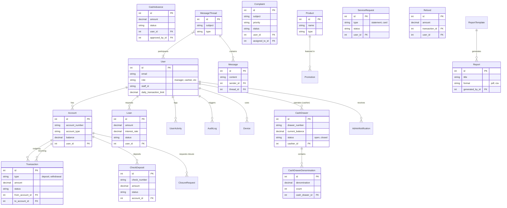

# Coastal Banking System - Entity Relationship Diagram

```mermaid
erDiagram
    %% USER MANAGEMENT
    User ||--o{ Account : "has"
    User ||--o{ Loan : "requests"
    User ||--o{ UserActivity : "logs"
    User ||--o{ AuditLog : "triggers"
    User ||--o{ Device : "uses"
    User ||--o{ CashDrawer : "operates (cashier)"
    User ||--o{ AdminNotification : "receives"

    User {
        int id PK
        string email
        string role "manager, cashier, etc"
        string staff_id
        decimal daily_transaction_limit
    }

    %% ACCOUNTS & TRANSACTIONS
    Account ||--o{ Transaction : "outgoing"
    Account ||--o{ Transaction : "incoming"
    Account ||--o{ CheckDeposit : "deposits"
    Account ||--o{ ClosureRequest : "requests closure"

    Account {
        int id PK
        string account_number
        string account_type
        decimal balance
        int user_id FK
    }

    Transaction {
        int id PK
        string type "deposit, withdrawal"
        decimal amount
        string status
        int from_account_id FK
        int to_account_id FK
    }

    CheckDeposit {
        int id PK
        string check_number
        decimal amount
        string status
        int account_id FK
    }

    %% LOANS
    Loan {
        int id PK
        decimal amount
        decimal interest_rate
        string status
        int user_id FK
    }

    %% CASHIER OPERATIONS
    CashDrawer ||--o{ CashDrawerDenomination : "contains"
    
    CashDrawer {
        int id PK
        string drawer_number
        decimal current_balance
        string status "open, closed"
        int cashier_id FK
    }

    CashDrawerDenomination {
        int id PK
        decimal denomination
        int count
        int cash_drawer_id FK
    }

    CashAdvance {
        int id PK
        decimal amount
        string status
        int user_id FK
        int approved_by_id FK
    }

    %% COMMUNICATION
    MessageThread ||--o{ Message : "contains"
    MessageThread }|--|{ User : "participants"
    
    MessageThread {
        int id PK
        string subject
        string type
    }

    Message {
        int id PK
        string content
        int sender_id FK
        int thread_id FK
    }

    Complaint {
        int id PK
        string subject
        string priority
        string status
        int user_id FK
        int assigned_to_id FK
    }

    %% PRODUCTS & REQUESTS
    Product ||--o{ Promotion : "featured in"
    
    Product {
        int id PK
        string name
        string type
    }
    
    ServiceRequest {
        int id PK
        string type "statement, card"
        string status
        int user_id FK
    }

    Refund {
        int id PK
        decimal amount
        int transaction_id FK
        int user_id FK
    }

    %% REPORTS
    ReportTemplate ||--o{ Report : "generates"
    
    Report {
        int id PK
        string title
        string format "pdf, csv"
        int generated_by_id FK
    }
```
